```{r setup, include=FALSE}
knitr::opts_chunk$set(echo = TRUE, eval = FALSE, fig.asp = 0.618, fig.width = 6, fig.align = 'center')
```

## Ggplot Tutorial - Part 2: Customizing the Look and Feel

This is part 2 of a three part tutorial on ggplot2, an aesthetically pleasing (and very popular) graphics framework in R. This tutorial is primarily geared towards those having some basic knowledge of the R programming language and want to make complex and nice looking charts with R ggplot. 

 * [Part 1: Introduction to Ggplot](ggplot2-r-Tutorial-Part1.html), covers the basic knowledge about constructing simple ggplots and modifying the components and aesthetics.
 
 * [Part 2: Customizing the Look and Feel](ggplot2-r-Tutorial-Part2.html), is about more advanced customizations related to styling the plot elements (like legend, annotations, multiplots with faceting and custom layout, etc) and manipulating the output. 
 
 * [Part 3: Top 50 Ggplot2 Visualizations - The Master List](ggplot2-r-Tutorial-Part3.html), applies what we learnt in part 1 and 2 to construct other types of ggplots such as bar charts, boxplots etc.

### Part 2: Customizing the look and feel
In this tutorial, I will cover how to modify and customize the looks of:

1. [Plot and Axis Titles](ggplot2-r-Tutorial-Part2.html#1. Plot and Axis Titles)
2. [Modifying Legend](ggplot2-r-Tutorial-Part2.html#2. Modifying Legend)
3. [Text, Label and Annotation](ggplot2-r-Tutorial-Part2.html#3. Text, Label and Annotation)
4. [Flipping and Reversing X and Y Axis](ggplot2-r-Tutorial-Part2.html#4. Flipping and Reversing X and Y Axis)
5. [Faceting: Draw multiple plots within one figure](ggplot2-r-Tutorial-Part2.html#5. Faceting: Draw multiple plots within one figure)
6. [Plot Background, Major and Minor Axis](ggplot2-r-Tutorial-Part2.html#6. Plot Background, Major and Minor Axis)

Let's begin with a scatterplot of Population against Area where the point's color and size vary based on state (categorial) and `popdensity` (continuous) respectively.
```{r}
# Setup
options(scipen=999)
library(ggplot2)
data("midwest", package = "ggplot2")
theme_set(theme_bw())
# midwest <- read.csv("http://goo.gl/G1K41K")  # bkup data source

# Add plot components --------------------------------
gg <- ggplot(midwest, aes(x=area, y=poptotal)) + 
  geom_point(aes(col=state, size=popdensity)) + 
  geom_smooth(method="loess", se=F) + xlim(c(0, 0.1)) + ylim(c(0, 500000)) + 
  labs(title="Area Vs Population", y="Population", x="Area", caption="Source: midwest")

# Call plot ------------------------------------------
plot(gg)
```


Let's discuss a number of tasks related to changing the plot output, starting with modifying the legend.

## 1. Plot and Axis Titles
The aesthetics of components such as plot and axis titles and the axis text can also be customized. Since they are part of the plot's theme, it has to be passed to the `theme()` function and the values need to be set using the `element_text()` function. 

The arguments passed to `theme()` components require to be set using special `element_type()` functions. They are of 4 major types.

1. `element_text()`: Since the title, subtitle and captions are textual items, `element_text()` function is used to set it.
2. `element_line()`: Likewise `element_line()` is use to modify line based components such as [axis line, major and minor grid lines](Plot Background, Major and Minor Axis](ggplot2-r-Tutorial-Part2.html#6. Plot Background, Major and Minor Axis)
3. `element_rect()`: Modifies rectangle components such as [plot and panel background](ggplot2-r-Tutorial-Part2.html#6. Plot Background, Major and Minor Axis)
4. `element_blank()`: Turns off displaying the theme item.

Below, I have changed the size, color, face and line-height. The axis text can be tilted by changing the `angle`. 


```{r}
library(ggplot2)

# Base Plot
gg <- ggplot(midwest, aes(x=area, y=poptotal)) + 
  geom_point(aes(col=state, size=popdensity)) + 
  geom_smooth(method="loess", se=F) + xlim(c(0, 0.1)) + ylim(c(0, 500000)) + 
  labs(title="Area Vs Population", y="Population", x="Area", caption="Source: midwest")

# Modify theme components -------------------------------------------
gg + theme(plot.title=element_text(size=20, 
                                    face="bold", 
                                    family="American Typewriter",
                                    color="tomato",
                                    hjust=0.5,
                                    lineheight=1.2),  # title
            plot.subtitle=element_text(size=15, 
                                       family="American Typewriter",
                                       face="bold",
                                       hjust=0.5),  # subtitle
            plot.caption=element_text(size=15),  # caption
            axis.title.x=element_text(vjust=10,  
                                      size=15),  # X axis title
            axis.title.y=element_text(size=15),  # Y axis title
            axis.text.x=element_text(size=10, 
                                     angle = 30,
                                     vjust=.5),  # X axis text
            axis.text.y=element_text(size=10))  # Y axis text
```

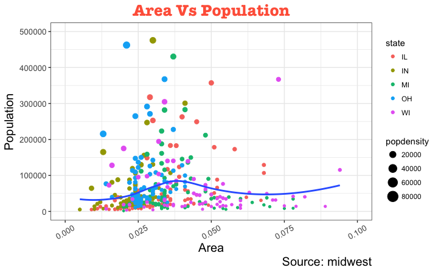


* `vjust`, controls the vertical spacing between title (or label) and plot.
* `hjust`, controls the horizontal spacing. Setting it to 0.5 centers the title.
* `family`, is used to set a new font
* `face`, sets the font face ("plain", "italic", "bold", "bold.italic")

Above example covers some of the frequently used theme modifications and the actual list is too long. So `?theme` is the first place you want to look at if you want to change the look and feel of any component.


## 2. Modifying Legend

### Legend Title
Let's begin with changing the legend title. We have two legends, one each for color and size. The size is based on a continuous variable while the color is based on a categorical(discrete).

There are 3 ways to change the legend title.

#### Method 1: Using `labs()`
```{r}
library(ggplot2)

# Base Plot
gg <- ggplot(midwest, aes(x=area, y=poptotal)) + 
  geom_point(aes(col=state, size=popdensity)) + 
  geom_smooth(method="loess", se=F) + xlim(c(0, 0.1)) + ylim(c(0, 500000)) + 
  labs(title="Area Vs Population", y="Population", x="Area", caption="Source: midwest")

gg + labs(color="State", size="Density")  # modify legend title
```
<br>

#### Method 2: Using `guides()`
```{r}
library(ggplot2)

# Base Plot
gg <- ggplot(midwest, aes(x=area, y=poptotal)) + 
  geom_point(aes(col=state, size=popdensity)) + 
  geom_smooth(method="loess", se=F) + xlim(c(0, 0.1)) + ylim(c(0, 500000)) + 
  labs(title="Area Vs Population", y="Population", x="Area", caption="Source: midwest")

gg <- gg + guides(color=guide_legend("State"), size=guide_legend("Density"))  # modify legend title
plot(gg)
```
<br>

#### Method 3: Using `scale_aesthetic_vartype()` format
The format of `scale_aestheic_vartype()` (like `scale_size_continuous()`) allows you to turn off legend for one particular aesthetic, leaving the rest in place. This can be done just by setting `guide=FALSE`.

```{r}
library(ggplot2)

# Base Plot
gg <- ggplot(midwest, aes(x=area, y=poptotal)) + 
  geom_point(aes(col=state, size=popdensity)) + 
  geom_smooth(method="loess", se=F) + xlim(c(0, 0.1)) + ylim(c(0, 500000)) + 
  labs(title="Area Vs Population", y="Population", x="Area", caption="Source: midwest")

# Modify Legend
gg + scale_color_discrete(name="State") + scale_size_continuous(name = "Density", guide = FALSE)  # turn off legend for size
```
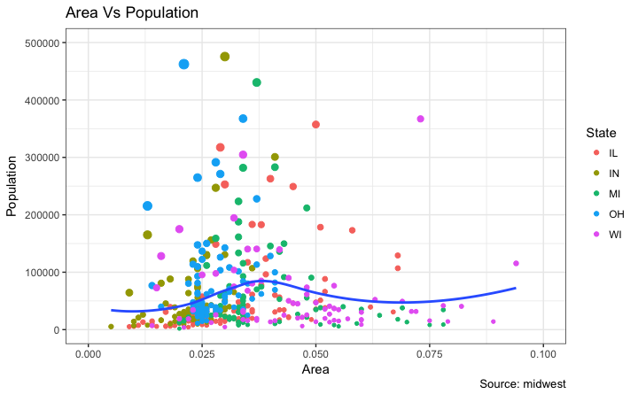


### How to Change Legend Labels and Point Colors for Categories
```{r}
library(ggplot2)

# Base Plot
gg <- ggplot(midwest, aes(x=area, y=poptotal)) + 
  geom_point(aes(col=state, size=popdensity)) + 
  geom_smooth(method="loess", se=F) + xlim(c(0, 0.1)) + ylim(c(0, 500000)) + 
  labs(title="Area Vs Population", y="Population", x="Area", caption="Source: midwest")

gg + scale_color_manual(name="State", 
                        labels = c("Illinois", 
                                   "Indiana", 
                                   "Michigan", 
                                   "Ohio", 
                                   "Wisconsin"), 
                        values = c("IL"="blue", 
                                   "IN"="red", 
                                   "MI"="green", 
                                   "OH"="brown", 
                                   "WI"="orange"))
```

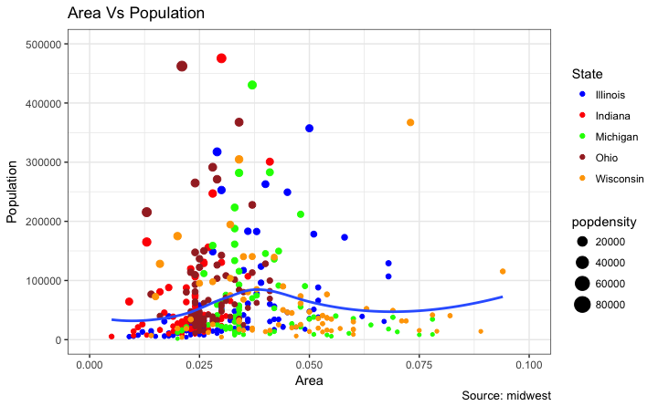

### Change the Order of Legend
In case you want to show the legend for color (`State`) before size (`Density`).
```{r}
library(ggplot2)

# Base Plot
gg <- ggplot(midwest, aes(x=area, y=poptotal)) + 
  geom_point(aes(col=state, size=popdensity)) + 
  geom_smooth(method="loess", se=F) + xlim(c(0, 0.1)) + ylim(c(0, 500000)) + 
  labs(title="Area Vs Population", y="Population", x="Area", caption="Source: midwest")

gg + guides(colour = guide_legend(order = 1),
            size = guide_legend(order = 2))
```
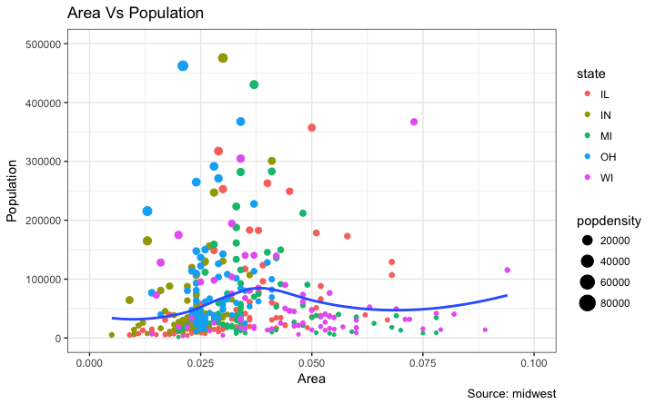


### How to Style the Legend Title, Text and Key
The styling of legend title, text, key and the guide can also be adjusted.
```{r}
library(ggplot2)

# Base Plot
gg <- ggplot(midwest, aes(x=area, y=poptotal)) + 
  geom_point(aes(col=state, size=popdensity)) + 
  geom_smooth(method="loess", se=F) + xlim(c(0, 0.1)) + ylim(c(0, 500000)) + 
  labs(title="Area Vs Population", y="Population", x="Area", caption="Source: midwest")

gg + theme(legend.title = element_text(size=12, color = "firebrick"), 
           legend.text = element_text(size=10),
           legend.key=element_rect(fill='springgreen')) + 
  guides(colour = guide_legend(override.aes = list(size=2, stroke=1.5))) 
```

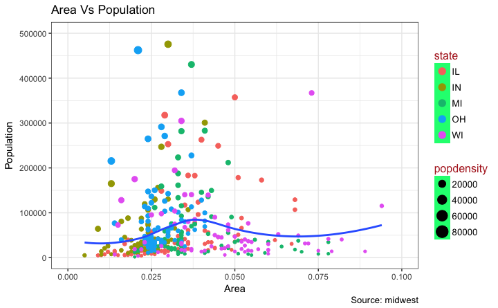

### Legend Positions
The legend's position inside the plot is an aspect of the theme. So it can be modified using the `theme()` function. If you want to place the legend inside the plot, you can additionally control the hinge point of the legend using `legend.justification`. 

The `legend.position` is the x and y axis position in chart area, where `(0,0)` is bottom left of the chart and `(1,1)` is top right. Likewise, `legend.justification` refers to the hinge point inside the legend.

```{r, fig.show='hold'}
library(ggplot2)

# Base Plot
gg <- ggplot(midwest, aes(x=area, y=poptotal)) + 
  geom_point(aes(col=state, size=popdensity)) + 
  geom_smooth(method="loess", se=F) + xlim(c(0, 0.1)) + ylim(c(0, 500000)) + 
  labs(title="Area Vs Population", y="Population", x="Area", caption="Source: midwest")

# No legend --------------------------------------------------
gg + theme(legend.position="None") + labs(subtitle="No Legend")

# Legend to the left -----------------------------------------
gg + theme(legend.position="left") + labs(subtitle="Legend on the Left")

# legend at the bottom and horizontal ------------------------
gg + theme(legend.position="bottom", legend.box = "horizontal") + labs(subtitle="Legend at Bottom")

# legend at bottom-right, inside the plot --------------------
gg + theme(legend.title = element_text(size=12, color = "salmon", face="bold"),
           legend.justification=c(1,0), 
           legend.position=c(0.95, 0.05),  
           legend.background = element_blank(),
           legend.key = element_blank()) + 
  labs(subtitle="Legend: Bottom-Right Inside the Plot")

# legend at top-left, inside the plot -------------------------
gg + theme(legend.title = element_text(size=12, color = "salmon", face="bold"),
           legend.justification=c(0,1), 
           legend.position=c(0.05, 0.95),
           legend.background = element_blank(),
           legend.key = element_blank()) + 
  labs(subtitle="Legend: Top-Left Inside the Plot")
```

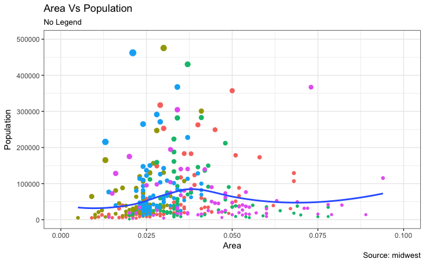
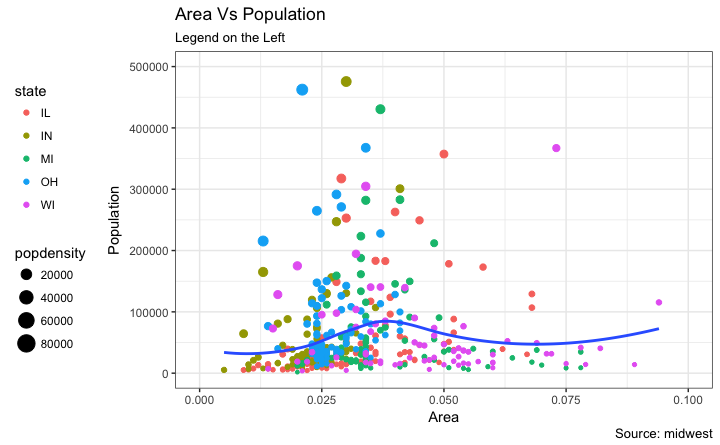
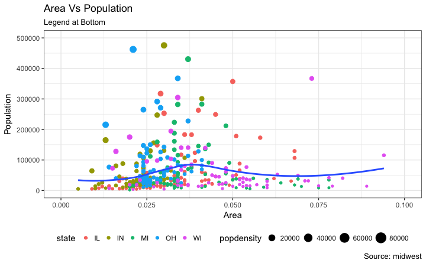
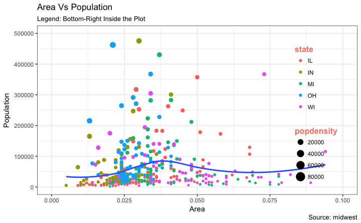


## 3. Text, Label and Annotation

### Text and Label around the points
Let's try adding some text. We will add text to those counties with population greater than 400K. In order to achieve this, I create another dataframe (`midwest_sub`) that contains only the counties that qualifies the said condition. Then, draw the `geom_text` and `geom_label` with this new dataframe as the `data` source. This will ensure that labels (`geom_label`) are added only for the points contained in the new dataframe.  

```{r}
library(ggplot2)

# Filter required rows.
midwest_sub <- midwest[midwest$poptotal > 300000, ]
midwest_sub$large_county <- ifelse(midwest_sub$poptotal > 300000, midwest_sub$county, "")

# Base Plot
gg <- ggplot(midwest, aes(x=area, y=poptotal)) + 
  geom_point(aes(col=state, size=popdensity)) + 
  geom_smooth(method="loess", se=F) + xlim(c(0, 0.1)) + ylim(c(0, 500000)) + 
  labs(title="Area Vs Population", y="Population", x="Area", caption="Source: midwest")

# Plot text and label ------------------------------------------------------
gg + geom_text(aes(label=large_county), size=2, data=midwest_sub) + labs(subtitle="With ggplot2::geom_text") + theme(legend.position = "None")   # text

gg + geom_label(aes(label=large_county), size=2, data=midwest_sub, alpha=0.25) + labs(subtitle="With ggplot2::geom_label") + theme(legend.position = "None")  # label

# Plot text and label that REPELS eachother (using ggrepel pkg) ------------
library(ggrepel)
gg + geom_text_repel(aes(label=large_county), size=2, data=midwest_sub) + labs(subtitle="With ggrepel::geom_text_repel") + theme(legend.position = "None")   # text

gg + geom_label_repel(aes(label=large_county), size=2, data=midwest_sub) + labs(subtitle="With ggrepel::geom_label_repel") + theme(legend.position = "None")   # label
```

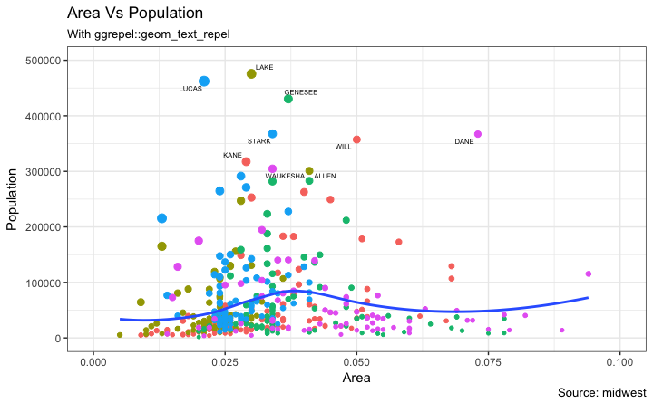


Since the label is looked up from a different dataframe, we need to set the data argument.


### Annotation
Let's see how to add annotation to any specific point of the chart. It can be done with the `annotation_custom()` function which takes in a `grob` as the argument. So, let's create a grob the holds the text you want to display using the `grid` package.
```{r}
library(ggplot2)

# Base Plot
gg <- ggplot(midwest, aes(x=area, y=poptotal)) + 
  geom_point(aes(col=state, size=popdensity)) + 
  geom_smooth(method="loess", se=F) + xlim(c(0, 0.1)) + ylim(c(0, 500000)) + 
  labs(title="Area Vs Population", y="Population", x="Area", caption="Source: midwest")

# Define and add annotation -------------------------------------
library(grid)
my_text <- "This text is at x=0.7 and y=0.8!"
my_grob = grid.text(my_text, x=0.7,  y=0.8, gp=gpar(col="firebrick", fontsize=14, fontface="bold"))
gg + annotation_custom(my_grob)
```

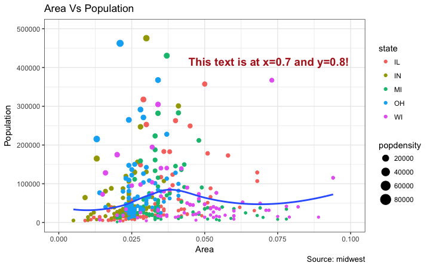

## 4. Flipping and Reversing X and Y Axis
### How to flip the X and Y axis?
Just add `coord_flip()`.
```{r}
library(ggplot2)

# Base Plot
gg <- ggplot(midwest, aes(x=area, y=poptotal)) + 
  geom_point(aes(col=state, size=popdensity)) + 
  geom_smooth(method="loess", se=F) + xlim(c(0, 0.1)) + ylim(c(0, 500000)) + 
  labs(title="Area Vs Population", y="Population", x="Area", caption="Source: midwest", subtitle="X and Y axis Flipped") + theme(legend.position = "None")

# Flip the X and Y axis -------------------------------------------------
gg + coord_flip()
```

### How to reverse the scale of an axis?
This is quite simple. Use `scale_x_reverse()` for X axis and `scale_y_reverse()` for Y axis.
```{r}
library(ggplot2)

# Base Plot
gg <- ggplot(midwest, aes(x=area, y=poptotal)) + 
  geom_point(aes(col=state, size=popdensity)) + 
  geom_smooth(method="loess", se=F) + xlim(c(0, 0.1)) + ylim(c(0, 500000)) + 
  labs(title="Area Vs Population", y="Population", x="Area", caption="Source: midwest", subtitle="Axis Scales Reversed") + theme(legend.position = "None")

# Reverse the X and Y Axis ---------------------------
gg + scale_x_reverse() + scale_y_reverse()
```

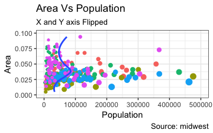
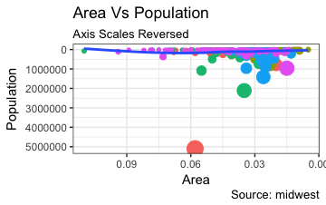

## 5. Faceting: Draw multiple plots within one figure
Let's use a the `mpg` dataset for this one. It is available in the ggplot2 package, or you can read it from this link.

```{r}
library(ggplot2)
data(mpg, package="ggplot2")  # load data
# mpg <- read.csv("http://goo.gl/uEeRGu")  # alt data source

g <- ggplot(mpg, aes(x=displ, y=hwy)) + 
      geom_point() + 
      labs(title="hwy vs displ", caption = "Source: mpg") +
      geom_smooth(method="lm", se=FALSE) + 
      theme_bw()  # apply bw theme
plot(g)
```
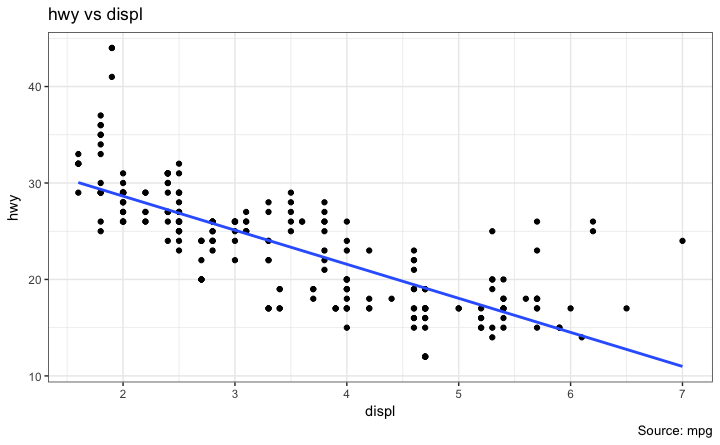

We have a simple chart of highway mileage `(hwy)` against the engine displacement `(displ)` for the whole dataset. But what if you want to study how this relationship varies for different classes of vehicles?

The `facet_wrap()` does just that. By default, all the plots share the same scale in both X and Y axis. You can set them free by setting `scales='free'` but this way it could be harder to compare the groups.
```{r}
library(ggplot2)

# Base Plot
g <- ggplot(mpg, aes(x=displ, y=hwy)) + 
      geom_point() + 
      geom_smooth(method="lm", se=FALSE) + 
      theme_bw()  # apply bw theme

# Facet wrap with common scales
g + facet_wrap( ~ class, nrow=3) + labs(title="hwy vs displ", caption = "Source: mpg", subtitle="Ggplot2 - Faceting - Multiple plots in one figure")  # Shared scales

# Facet wrap with free scales
g + facet_wrap( ~ class, scales = "free") + labs(title="hwy vs displ", caption = "Source: mpg", subtitle="Ggplot2 - Faceting - Multiple plots in one figure with free scales")  # Scales free
```
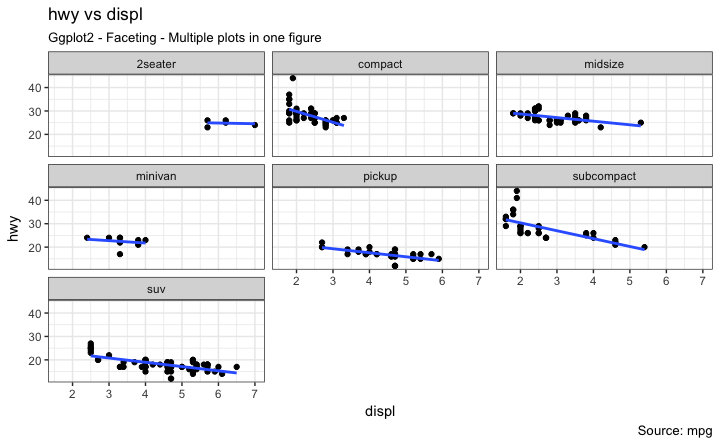
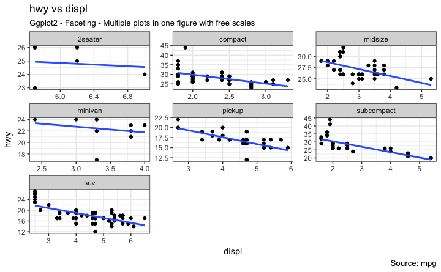

So, What do you infer from this?
For one, most 2 seater cars have higher engine displacement while the minivan and compact vehicles are on the lower side. This is evident from where the points are placed along the X-axis.

Also, the highway mileage drops across all segments as the engine displacement increases. This drop seems more pronounced in compact and subcompact vehicles.

The headings of the middle and bottom rows take up significant space. The `facet_grid()` would get rid of it and give more area to the charts. The main difference with `facet_grid` is that it is not possible to choose the number of rows and columns in the grid.

Alright, Let's create a grid to see how it varies with manufacturer.
```{r}
library(ggplot2)

# Base Plot
g <- ggplot(mpg, aes(x=displ, y=hwy)) + 
      geom_point() + 
      labs(title="hwy vs displ", caption = "Source: mpg", subtitle="Ggplot2 - Faceting - Multiple plots in one figure") +
      geom_smooth(method="lm", se=FALSE) + 
      theme_bw()  # apply bw theme

# Add Facet Grid
g1 <- g + facet_grid(manufacturer ~ class)  # manufacturer in rows and class in columns
plot(g1)
```

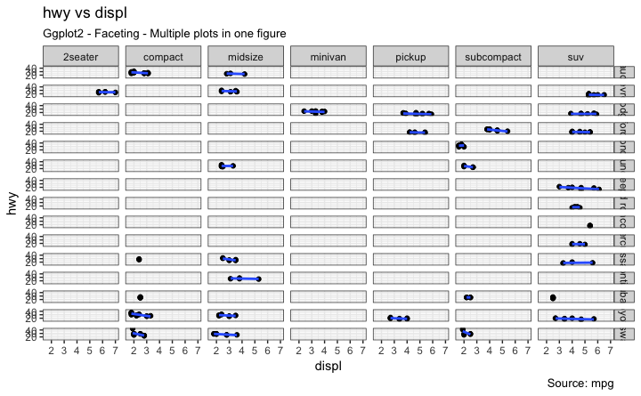


Let's make one more to vary by cylinder.
```{r}
library(ggplot2)

# Base Plot
g <- ggplot(mpg, aes(x=displ, y=hwy)) + 
      geom_point() + 
      geom_smooth(method="lm", se=FALSE) + 
      labs(title="hwy vs displ", caption = "Source: mpg", subtitle="Ggplot2 - Facet Grid - Multiple plots in one figure") +
      theme_bw()  # apply bw theme

# Add Facet Grid
g2 <- g + facet_grid(cyl ~ class)  # cyl in rows and class in columns.
plot(g2)
```

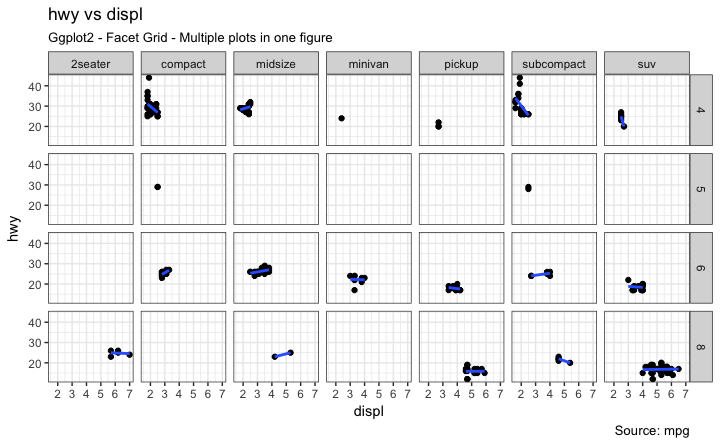

Great!. It is possible to layout both these charts in the sample panel. I prefer the `gridExtra()` package for this.
```{r}
# Draw Multiple plots in same figure.
library(gridExtra)
gridExtra::grid.arrange(g1, g2, ncol=2)
```
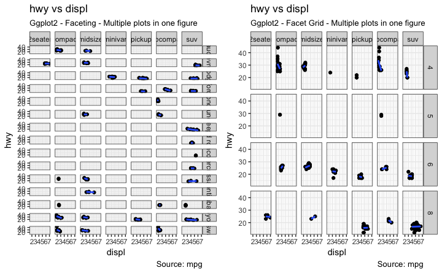


## 6. Plot Background, Major and Minor Axis

### Change Plot background
```{r}
library(ggplot2)

# Base Plot
g <- ggplot(mpg, aes(x=displ, y=hwy)) + 
      geom_point() + 
      geom_smooth(method="lm", se=FALSE) + 
      theme_bw()  # apply bw theme

# Change Plot Background elements -----------------------------------
g + theme(panel.background = element_rect(fill = 'khaki'),
          panel.grid.major = element_line(colour = "burlywood", size=1.5),
          panel.grid.minor = element_line(colour = "tomato", 
                                          size=.25, 
                                          linetype = "dashed"),
          panel.border = element_blank(),
          axis.line.x = element_line(colour = "darkorange", 
                                     size=1.5, 
                                     lineend = "butt"),
          axis.line.y = element_line(colour = "darkorange", 
                                     size=1.5)) +
    labs(title="Modified Background", 
         subtitle="How to Change Major and Minor grid, Axis Lines, No Border")

# Change Plot Margins -----------------------------------------------
g + theme(plot.background=element_rect(fill="salmon"), 
          plot.margin = unit(c(2, 2, 1, 1), "cm")) +  # top, right, bottom, left
    labs(title="Modified Background", subtitle="How to Change Plot Margin")  
```
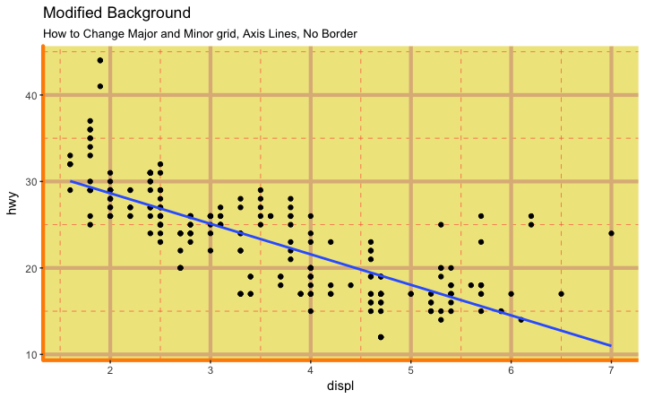
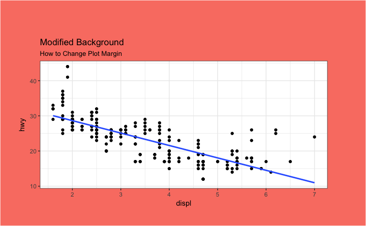

### Removing major and minor grid, border, axis title, text and ticks
```{r}
library(ggplot2)

# Base Plot
g <- ggplot(mpg, aes(x=displ, y=hwy)) + 
      geom_point() + 
      geom_smooth(method="lm", se=FALSE) + 
      theme_bw()  # apply bw theme

g + theme(panel.grid.major = element_blank(), 
          panel.grid.minor = element_blank(), 
          panel.border = element_blank(),
          axis.title = element_blank(), 
          axis.text = element_blank(),
          axis.ticks = element_blank()) +
  labs(title="Modified Background", subtitle="How to remove major and minor axis grid, border, axis title, text and ticks") 
```
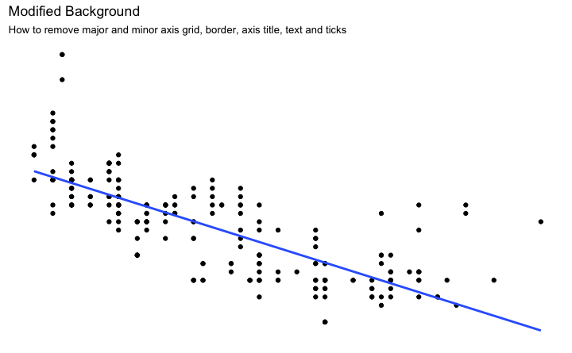

### Add an image in background
```{r}
library(ggplot2)
library(grid)
library(png)

img <- png::readPNG("screenshots/Rlogo.png")  # source: https://www.r-project.org/
g_pic <- rasterGrob(img, interpolate=TRUE)

# Base Plot
g <- ggplot(mpg, aes(x=displ, y=hwy)) + 
      geom_point() + 
      geom_smooth(method="lm", se=FALSE) + 
      theme_bw()  # apply bw theme

g + theme(panel.grid.major = element_blank(), 
          panel.grid.minor = element_blank(), 
          plot.title = element_text(size = rel(1.5), face = "bold"),
          axis.ticks = element_blank()) + 
  annotation_custom(g_pic, xmin=5, xmax=7, ymin=30, ymax=45)
```
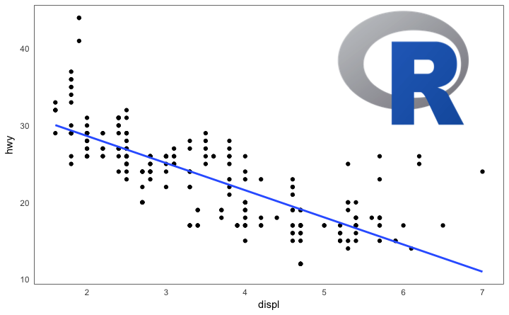

### Inheritance Structure of Theme Components


source: http://docs.ggplot2.org/dev/vignettes/themes.html
___________________________________________________

Have a suggestion or found a bug? Notify [here.](https://docs.google.com/forms/d/e/1FAIpQLSeIJmlvwe562R7JVpi5J2ydLyhk5-7OrGRMFGYrMJvjPal8eA/viewform)

_**Editors Note:** The [mastering R programming](packtpub.com/big-data-and-business-intelligence/mastering-r-programming-video) video course has a dedicated section for ggplot2 where the concepts are demonstrated in detail. Additionally it includes solving real coding challenges at the end of every video lesson._